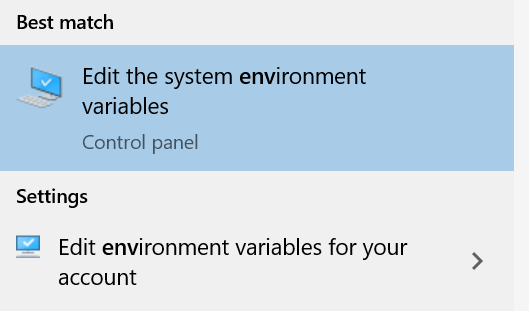
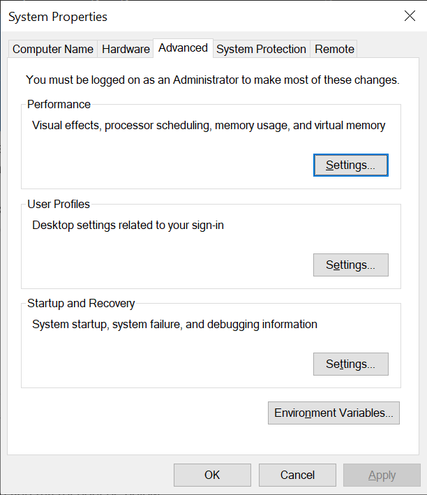
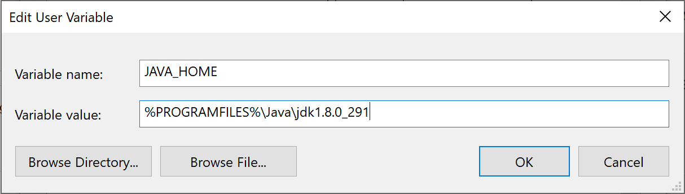
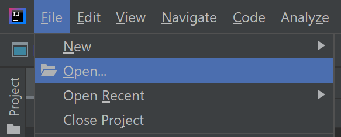
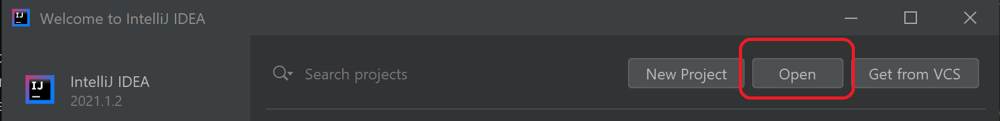
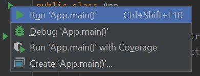
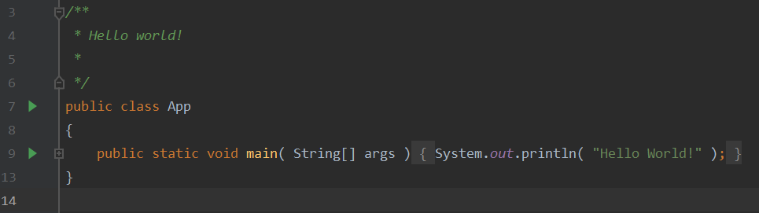
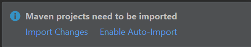
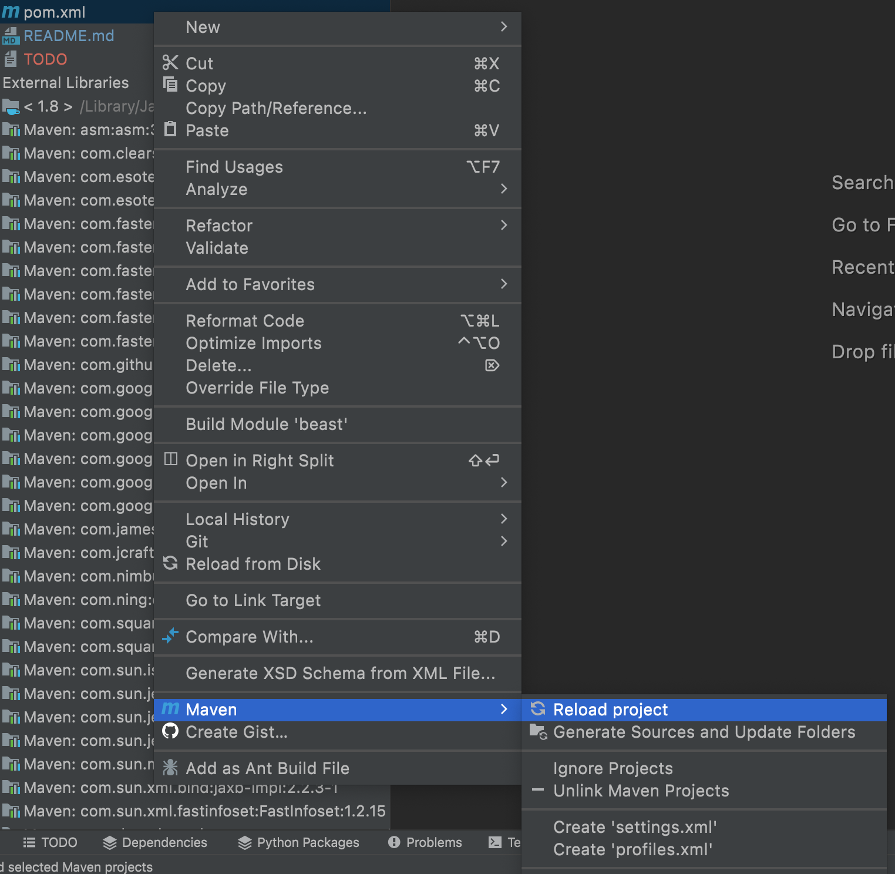

# Lab 1

## Objectives
-   Set up the development environment for Java.
-   Run a test program on Spark within the IDE.
-   Package the source code of your project in a compressed form.
-   (Optional) Run the program from command line

## Prerequisites
-   Create an Oracle account and download JDK 1.8  
    [https://www.oracle.com/java/technologies/javase-jdk8-downloads.html](https://www.oracle.com/java/technologies/javase-jdk8-downloads.html)
-   Download IntelliJ IDEA Community Edition  
    [https://www.jetbrains.com/idea/download/index.html](https://www.jetbrains.com/idea/download/index.html)
-   Download Maven binaries (Cross platform)  
    [http://maven.apache.org/download.cgi](http://maven.apache.org/download.cgi)
-   Download Spark binaries v3.1.2  
    [https://spark.apache.org/downloads.html](https://hadoop.apache.org/releases.html)

## Lab Work
Follow the instructions below to complete this lab.

### Install Required Software
#### JDK

*  Run the installer (Windows and Mac) or extract the binary package (Linux) depending on your system.
    
* Set the environment variable JAVA_HOME to the home directory of JDK.
  * (Linux) Add export `JAVA_HOME=$HOME/jdk1.8.0_131` to `$HOME/.bashrc`
  * (Mac) Add `export JAVA_HOME=/Library/Java/JavaVirtualMachines/jdk1.8.0_251.jdk/Contents/Home` to `$HOME/.zshrc` or `$HOME/.zprofile`
  * (Windows) On windows, to access the environment variables, open the start menu and start typing "Environment Variables" and the option "Edit the system environment variables" should appear.


 
From there, click on “Environment Variables” 
 


And then, press “New” and enter your environment variable as shown below.

    
    
* If the command `java` is not in your executable path, add `$JAVA_HOME/bin` to your executable path
E.g., Add `export PATH=$PATH:$JAVA_HOME/bin` to `$HOME/.bashrc` or `$HOME/.profile`

#### IntelliJ IDEA
* Follow the directions of the installer or extract the compressed file.

#### Maven
* Extract the compressed file and add `MAVEN_HOME/bin` to the executable path.

#### Spark (Optional)
* Extract the compressed file and add `$SPARK_HOME` to your environment variables and `$SPARK_HOME/bin` to your executable path.
* (Windows) If you run on Windows, download `hadoop.dll` and `winutils.exe` and place them in `$HADOOP_HOME/bin` directory. `$HADOOP_HOME` can be any directory, e.g., `$HOME/hadoop`. https://github.com/steveloughran/winutils

#### Create an Empty Java Project from Command Line
* Create a new directory `$HOME/Workspace` to place all your projects.
* Inside `$HOME/Workspace`, run the following command
```shell
mvn archetype:generate -DgroupId=eg.edu.alexu.<studentid> -DartifactId=<studentid>_lab1 -DarchetypeArtifactId=maven-archetype-quickstart -DinteractiveMode=false
```
Replace `<studentid>` with your unique student ID. It cannot start with a numeric digit.

* Change into the project directory and type `mvn package`
This command compiles your project and produces a JAR file with your compiled classes under the target directory.
* To run your newly created program, run `java -cp target/<JARFile> eg.edu.alexu.<studentid>.App`
Replace `<JARFile>` and `<studentid>` with the correct names.

#### Import Your Project into InelliJ IDEA
* Open IntelliJ IDEA and choose "File->open" or "Open" form the start window.

OR


* Choose the directory of your new Maven project.
* Open the "App.java" file and click the small green arrow to run the main class.




#### Configure for Spark
* Edit your `pom.xml` file and add the following code. This adds Spark libraries to your dependencies so that you an access Hadoop API.
```xml
<properties>
  <maven.compiler.source>1.8</maven.compiler.source>
  <maven.compiler.target>1.8</maven.compiler.target>
  <spark.version>3.1.2</spark.version>
</properties>

<dependencies>
  <dependency>
    <groupId>org.apache.spark</groupId>
    <artifactId>spark-core_2.12</artifactId>
    <version>${spark.version}</version>
    <scope>compile</scope>
  </dependency>
</dependencies>
```

Notice: If your pom.xml file already has a dependencies section, merge it with the one above.
* If the IDE asks for importing the changes in your pom.xml file, press “Import Changes” to accept the changes.



* To import the changes of the pom.xml file at any time, right click on the pom.xml file and choose Maven -> Reload project.



#### Create WordCount Example
* Replace the code in your App.java file with the following code but leave the package line as-is.


```java
import org.apache.spark.api.java.JavaPairRDD;
import org.apache.spark.api.java.JavaRDD;
import org.apache.spark.api.java.JavaSparkContext;
import scala.Tuple2;

import java.util.Arrays;

public class App 
{
    public static void main( String[] args )
    {
        JavaSparkContext sc = new JavaSparkContext("local", "test");
        JavaRDD<String> lines = sc.textFile("wordcount-input.txt");
        JavaRDD<String> words = lines.flatMap(l -> Arrays.asList(l.split("\\b")).iterator());
        JavaPairRDD<String, Integer> wordPairs = words.mapToPair(w -> new Tuple2<>(w, 1));
        JavaPairRDD<String, Integer> wordCounts = wordPairs.reduceByKey((a,b) -> a + b);
        wordCounts.saveAsTextFile("wordcount-output.txt")
    }
}
```

* Create a new text file named "wordcount-input.txt" and add the following sample content to it.
```text
I often repeat repeat myself
I often repeat repeat
I don't don't know why know why
I simply know that I I I
am am inclined to say to say
a lot a lot this way this way
I often repeat repeat myself
I often repeat repeat
```

Note: We will later cover how Spark programs are executed in more details. This lab just ensures that you have the development environment setup.

#### (Optional) Run the WordCount example from Command Line
* At the command line, type:
```console
mvn package 
```
* If Spark is installed on your machine, run the program using the following command: 
```console
spark-submit --class=eg.edu.alexu.<studentid>.App target/<JARFile>
```
