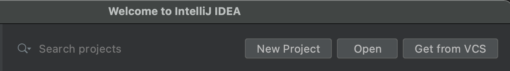
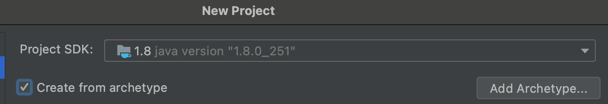
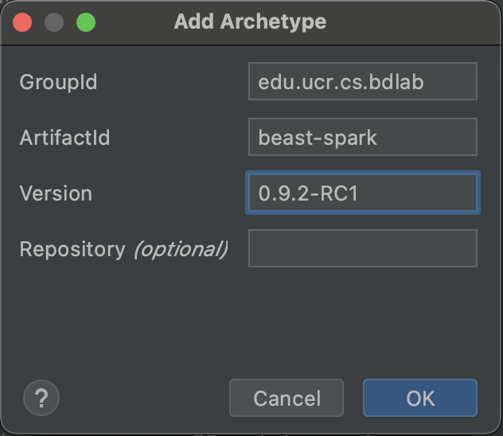
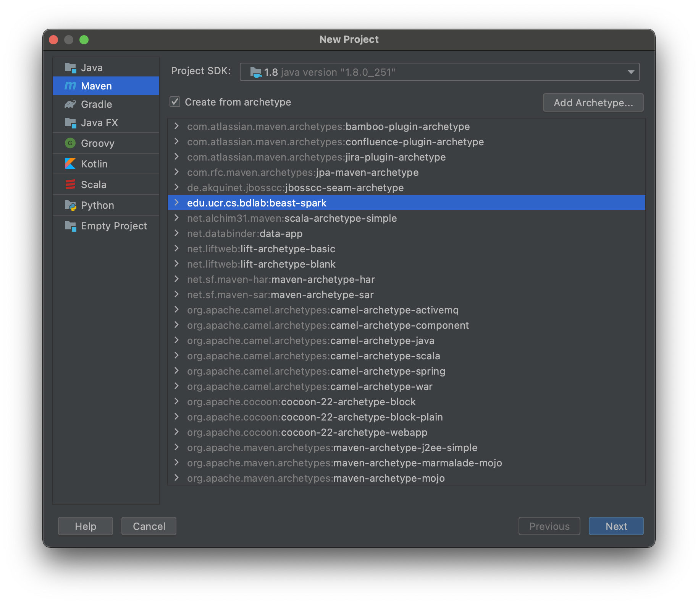
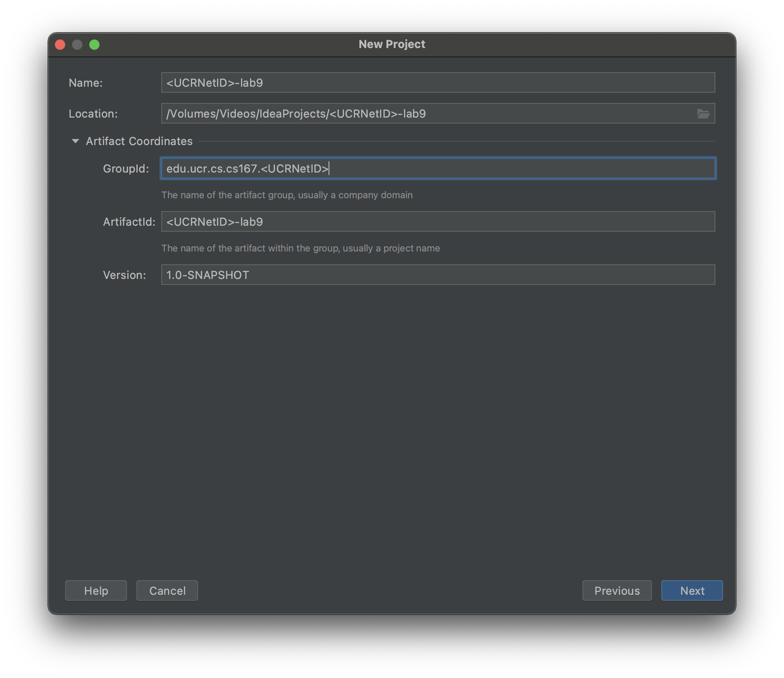
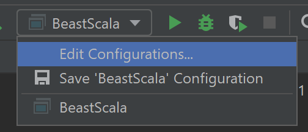
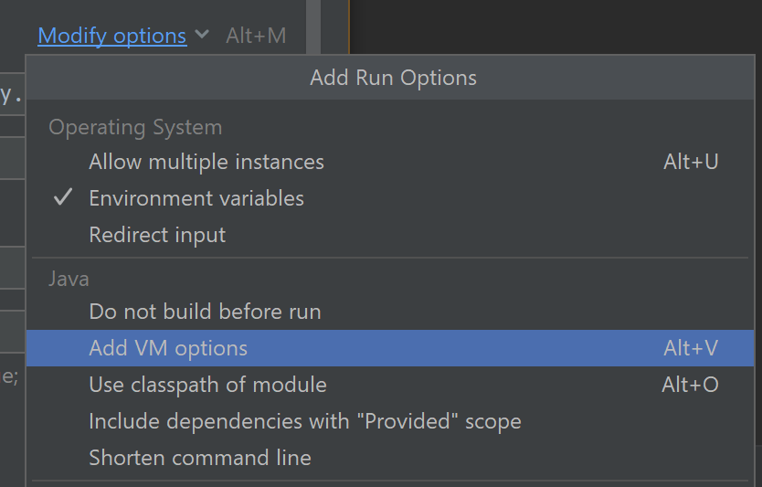
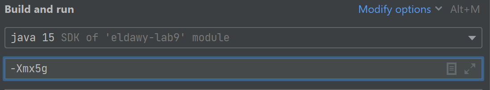

# Labs 5

## Objectives

* Browse and download datasets from [UCR-Star](https://star.cs.ucr.edu/).
* Use Beast to process big spatial data.
* Visualize big spatial data.

## Prerequisites
* Download the following files.
  - [Alexndria road network](https://star.cs.ucr.edu/?osm21/roads&d#mbr=stkwubd,stte7j8) (Hosted by UCR-Star). Download in CSV format and rename the file to `roads_alex.csv`.
  - [Egypt road network](https://star.cs.ucr.edu/?osm21/roads&d#mbr=sec6wd,stxzmp) in CSV format and renamte the file to `roads_egypt.csv`.
  - [Points of Interest in Egypt](https://star.cs.ucr.edu/?osm21/pois&d#mbr=sse9yn,sv85fg) in GeoJSON format file named `pois_egypt.geojson`.
  - [Provinces in Egypt](https://star.cs.ucr.edu/?NE/states_provinces&d#mbr=sec6wd,stxzmp) in GeoJSON format file named `provinces_egypt.geojson`.
* (Optional but highly recommended :wink: ) Like and follow UCR-Star social media pages on [Faceboook](https://www.facebook.com/ucrstar), [Twitter](https://twitter.com/ucrstar/), and [Instagram](https://www.instagram.com/theucrstar), to encourage the team to continue working on this project.


## Lab Work

### I. Project Setup (20 minutes)
The instructions below are all given using Scala. However, you are allowed to use Java if you prefer. Feel free to ask how to translate these functions from Scala to Java.
1. Create a new Beast project using Maven Beast template. Use the following command line and replace `<studentid>` with your student ID.
```shell
mvn archetype:generate -DgroupId=eg.edu.alexu.<studentid> -DartifactId=lab5 -DarchetypeGroupId=edu.ucr.cs.bdlab -DarchetypeArtifactId=beast-spark -DarchetypeVersion=0.9.3-RC1
```
2. Import the project into IntelliJ as a Maven project.
3. To make sure that it works correctly, run `mvn package` from command line to make sure that it compiles correctly.
4. Take a look into the main function in class `BeastScala` that comes with the template to see an example of how it works.
5. Remove the code inside the try-catch block except for the import line at the beginning.

Note: You can directly create the project from IntelliJ to avoid using command line by following these alternative instructions.
1. In IntelliJ welcome screen, choose New Project.

2. The first time you do this, you need to choose "Create from archetype" and press "Add Archetype...".

3. Enter the following archetype information and press "OK".

| Info   | Value |
| ------- | ----------------- |
| GroupId | edu.ucr.cs.bdlab |
| ArtifactId | beast-spark |
| Version | 0.9.3-RC1 |



4. Choose the newly added archetype and press "Next".

5. Enter the GroupId and ArtifactId after replacing `<UCRNetID>` with yours.

6. Finish creating the project


### II. Load and Insepct the Input (20 minutes)
First, we will load the input files that we will use throughout the lab. Since the input files have different file formats, the loading function would look different for each file.
1. Move all the downloaded files to your project directory. (Note: Do not include these files in your submission)
2. Use the following code to load the three datasets that we will use. Note that we will initially load the small Twitter dataset to get the results quickly and at the end we will run on the entire Twitter dataset by changing the filename.
```scala
val roads_alex = sparkContext.readWKT("roads_alex.csv", delimiter = '\t', skipHeader = true)
val governorates = sparkContext.geojsonFile("provinces_egypt.geojson")
val pois = sparkContext.geojsonFile("pois_egypt.geojson")
```
3. (Optional) To make sure that the files were downloaded correctly, add the following lines.

```scala
println(s"Number of roads is ${roads_alex.count()}")
println(s"Number of governorate ${governorates.count()}")
```

### III. Single-level Visualization
One of the first steps to explore big spatial data is to visualize it. Beast comes with several methods to visualize spatial data.

1. Single-level visualization. The following code visualizes the data as a single PNG image. This can be very helpful for a quick look into the data and to include in a presentation or a report.
```scala
pois.plotImage(2000, 2000, "pois.png")
```

2. Multilevel visualization. This visualization technique allows you to zoom in/out the data to see several levels of details for the data.
```scala
pois.plotPyramid("provinces_pyramid", 10, opts = "mercator" -> true)
```
This will produce a directory named `pois_pyramid` which contains a file named `index.html`. Open the HTML file in any browser to explore the data. You can increase the number of levels of details if you want to see more details but it will take much longer for each additional zoom level.
3. While this tutorial does not cover it, Beast can produce multilevel images more efficiently by the use of an adaptive index. You can find more details [on this link](https://bitbucket.org/bdlabucr/beast/src/master/doc/visualization.md).

### IV. Range filtering
The range query function in Beast allows you to filter data in any given query range. Below, we will filter the points of interest in Alexandria based on its boundaries and plot the results.
1. Extract the boundary of Alexandria from the provinces dataset.
```scala
val alexandria = provinces.filter(_.getAs[String]("name") == "Al Iskandariyah").first()
```
2. Run the range query to extract points in Alexandria.
```scala
val pois_alex = pois.rangeQuery(alexandria.getGeometry)
```
3. Visualize the result.
```scala
pois_alex.plotImage(2000, 2000, "pois_alex.png")
```

### V. Spatial Join
A very powerful geospatial operation is spatial join. It allows you to combine two or more spatial datasets for more powerful exploratory analytics. The following part joins the POIs and provinces datasets to assign each point to a governorate based on its location. Then, it counts the number of points per governorate.

```scala
val province_poi: RDD[(IFeature, IFeature)] = provinces.spatialJoin(pois)
println(province_poi.countByKey())
```

### Frequency Asked Questions (FAQ)
* Q: I get an out of memory error when I run on the entire dataset.
* A: This is an unfortunate common error with Spark which sometimes takes up too much memory. You can increase the memory capacity given to your program using the JVM parameter "Xmx". For example, to set the memory usage to 5GB, add the JVM parameter "-Xmx5g" (without the double quotes). See below for details.







